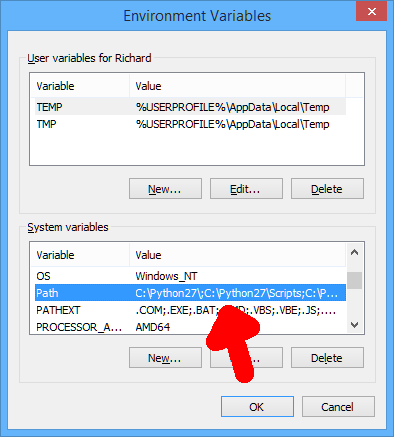
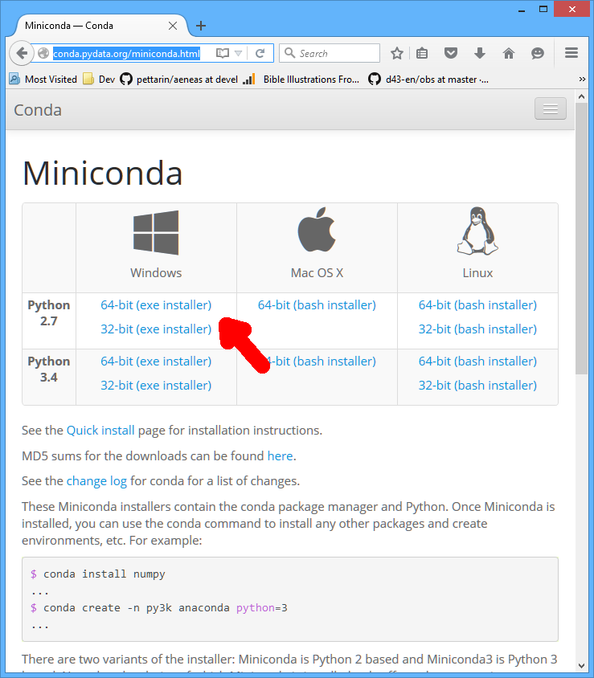
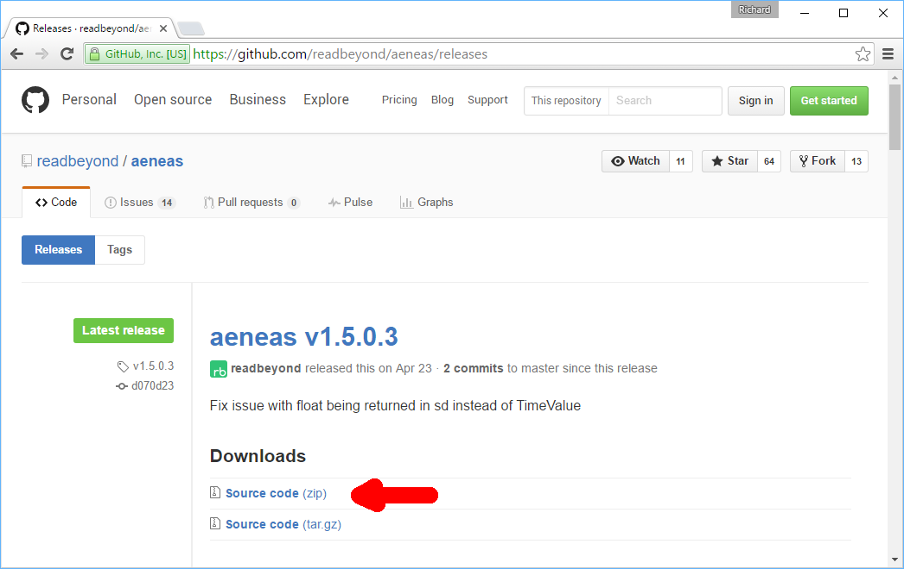

# Installing aeneas

**aeneas** and its dependencies can be installed in several ways.
The **recommended options** are:

* Linux: via `pip`;
* Mac OS X: using the all-in-one installer or via `brew`;
* Windows: using the all-in-one installer.

Clearly, you can also install **aeneas** from source;
in that case, just keep in mind:

* if you want to install **aeneas** system-wise,
  you might need `root` or `Administrator` privileges,
  especially if you are using `pip`.
  On Linux and Mac OS X, you probably can just use `sudo`:
  for example `sudo pip install aeneas` instead of `pip install aeneas`.
  On Windows, you might need to open a console as Administrator;
* you can install **aeneas** in a virtual environment
  created by `virtualenv`;
* **aeneas** provides a few extra tools (e.g., `download` and `plot_waveform`)
  which require extra dependencies.
  These extra tools are not installed by default:
  if you want to install them,
  use `pip install aeneas[full]` instead of `pip install aeneas`.

Below you can find detailed procedures for each operating system.


## OS Independent Via `pip`

1. Make sure you have
    `ffmpeg`, `ffprobe` (usually provided by the `ffmpeg` package),
    and `espeak` installed and available on your command line.
    You also need Python and its development package
    containing the C headers (`python-dev` or similar).

2. Install `aeneas` system-wise with `pip`:
    
    ```bash
    $ sudo pip install numpy
    $ sudo pip install aeneas
    ```
    
    **Note**: you must install `numpy` before `aeneas`,
    otherwise the setup process will fail.


## Linux

In Linux, you can install **aeneas**:

1. using the generic procedure described above; or
2. from source, using the manual procedure described below.

### Manual Procedure

1. If you are a user of a `deb`-based Linux distribution
(e.g., Debian or Ubuntu),
you can install all the dependencies by downloading and running
[the provided install_dependencies.sh script](https://raw.githubusercontent.com/readbeyond/aeneas/master/install_dependencies.sh)

    ```bash
    $ wget https://raw.githubusercontent.com/readbeyond/aeneas/master/install_dependencies.sh
    $ bash install_dependencies.sh
    ```

    If you have another Linux distribution,
    just make sure you have
    `ffmpeg`, `ffprobe` (usually provided by the `ffmpeg` package),
    and `espeak` installed and available on your command line.
    You also need Python and its development package
    containing the C headers (`python-dev` or similar).

2. Clone the `aeneas` repo, install Python dependencies, and compile C extensions:

    ```bash
    $ git clone https://github.com/ReadBeyond/aeneas.git
    $ cd aeneas
    $ sudo pip install -r requirements.txt
    $ python setup.py build_ext --inplace
    $ python aeneas_check_setup.py
    ```

    If the last command prints a success message,
    you have all the required dependencies installed
    and you can confidently run **aeneas** in production.

3. In alternative to the previous point, you can install `aeneas` with `pip`:
    
    ```bash
    $ sudo pip install numpy
    $ sudo pip install aeneas
    ```


## Mac OS X

In Mac OS X, you can install **aeneas**:

1. using the all-in-one installer (recommended); or
2. using `brew` (recommended for advanced users); or
3. via `pip`, using the generic procedure described above; or
4. from source, using the manual procedure described below.

### All-in-one Installer

[Daniel Bair](https://github.com/danielbair),
in partnership with [SIL International](http://www.sil.org),
developed an handy all-in-one installer,
providing **aeneas** and all the required dependencies,
that you can download from
[this Web page](https://github.com/sillsdev/aeneas-installer/releases).

### Via `brew`

Feel free to jump to step 3 if you already have `brew` installed in your system.

1. Install the Xcode command line tools:

    ```bash
    $ xcode-select --install
    ```

    Follow the instructions appearing on screen.

2. Install the `brew` packet manager:

    ```bash
    $ ruby -e "$(curl -fsSL https://raw.githubusercontent.com/Homebrew/install/master/install)"
    ```

3. Update `brew`:

    ```bash
    $ brew update
    ```

4. Install `aeneas`:

    ```bash
    $ brew install homebrew/python/aeneas
    ```

### Manual Procedure

Feel free to jump to step 9 if you already have
`python`, `ffmpeg`/`ffprobe` and `espeak` installed.

1. Install the Xcode command line tools:

    ```bash
    $ xcode-select --install
    ```

    Follow the instructions appearing on screen.

2. Install the `brew` packet manager:

    ```bash
    $ ruby -e "$(curl -fsSL https://raw.githubusercontent.com/Homebrew/install/master/install)"
    ```

3. Update `brew`:

    ```bash
    $ brew update
    ```

4. Install `espeak` and `ffmpeg` (which also provides `ffprobe`)  via `brew`:

    ```bash
    $ brew install espeak
    $ brew install ffmpeg
    ```

    **NOTE**: if you installed `espeak` before 2016-07-18,
    please update brew and upgrade the espeak formula
    (`brew update && brew upgrade --cleanup espeak`).
    This way you will benefit from the `aeneas.cew` extension,
    which requires the presence of the `libespeak` shared library in your system,
    added to the `brew` formula on that date.

5. Install Python:

    ```bash
    $ brew install python
    ```

6. Replace the default (Apple's) Python distribution with the Python installed by `brew`,
   by adding the following line at the end of your `~/.bash_profile`:

    ```bash
    export PATH=/usr/local/bin:/usr/local/sbin:~/bin:$PATH
    ```

7. Open a new terminal window. (This step is IMPORTANT!
   If you do not, you will still use Apple's Python,
   and everything in the Universe will go wrong!)

8. Check that you are running the new `python`:

    ```bash
    $ which python
    /usr/local/bin/python
    
    $ python --version
    Python 2.7.10 (or later)
    ```

9. Clone the `aeneas` repo, install Python dependencies, and compile C extensions:

    ```bash
    $ git clone https://github.com/ReadBeyond/aeneas.git
    $ cd aeneas
    $ sudo pip install -r requirements.txt
    $ python setup.py build_ext --inplace
    $ python aeneas_check_setup.py
    ```

    If the last command prints a success message,
    you have all the required dependencies installed
    and you can confidently run **aeneas** in production.

10. In alternative to the previous point, you can install `aeneas` with `pip`:
    
    ```bash
    $ sudo pip install numpy
    $ sudo pip install aeneas
    ```

#### Solving Errors When Compiling `cew`

Compilation of the Python C extension `cew` on Mac OS X is experimental,
and it requires the new brew formula installing `libespeak`,
the shared library version of eSpeak.
You can get it with:

```bash
$ brew update && brew upgrade --cleanup espeak
```

If something goes wrong with `cew` while installing **aeneas**,
you can disable the C extension `cew`
specifying the `AENEAS_WITH_CEW=False` environment variable:

```bash
$ AENEAS_WITH_CEW=False python setup.py build_ext --inplace
```

or

```bash
$ AENEAS_WITH_CEW=False sudo pip install aeneas
```


## Windows

In Windows, you can install **aeneas**:

1. using the all-in-one installer (strongly recommended); or
2. via `pip`, using the generic procedure described above; or
3. from source, using the manual procedure described below.

### All-in-one Installer

[Daniel Bair](https://github.com/danielbair),
in partnership with [SIL International](http://www.sil.org),
developed an handy all-in-one installer,
providing **aeneas** and all the required dependencies,
that you can download from
[this Web page](https://github.com/sillsdev/aeneas-installer/releases).

### Manual Procedure

On Windows it is recommended to run **aeneas**
with Python 2.7, since compiling the C extensions on Python 3.4 or 3.5
requires [a complex setup process](http://stackoverflow.com/questions/29909330/microsoft-visual-c-compiler-for-python-3-4).

The following guide was kindly provided by Richard Margetts of [SIL International](http://www.sil.org),
and it constituted a previous version of the
["Using aeneas for Audio-Text Synchronization" PDF](http://software.sil.org/scriptureappbuilder/resources/)
before the all-in-one installer was available (July 2016).

#### Manual Procedure Step 1: Create a parent folder for the installation

Create a parent folder to contain the different programs and packages needed to run **aeneas**:

1. Open Windows Explorer and navigate to the root of the `C:` drive.
2. Create a new folder and name it `sync`.

You will install the various programs and packages as subfolders of `C:\sync`,
e.g. `C:\sync\eSpeak`, `C:\sync\FFmpeg`, `C:\sync\aeneas-1.5.0.3`, etc.

#### Manual Procedure Step 2: Install eSpeak

**eSpeak** is the text-to-speech synthesizer that **aeneas** uses by default.

1. Go to the eSpeak website, [http://espeak.sourceforge.net/download.html](http://espeak.sourceforge.net/download.html).
2. Download and run the Windows install program, `setup_espeak-1.48.04.exe`.
   Choose to install to `C:\sync\eSpeak` (rather than the default `C:\Program Files (x86)\eSpeak`).
   To ensure that eSpeak installs correctly, it is best to close any programs you have open on your desktop before running the install program.
3. Add `C:\sync\eSpeak\command_line` to your system `PATH` variable, i.e. the path to where you have installed eSpeak and then the `command_line` sub-folder:
    1. Go to `Windows System Properties > Advanced > Environment Variables`.
       In Windows 8, you can get here by typing `system` in the Windows search box and selecting `Edit the system environment variables`.
    2. Find the `Path` variable in the `System variables` and double-click to edit it.

        

    3. Add the extra folder you want to add to the path at the end of the Variable value string. Note that folders in the path are separated by semi-colons, e.g. `c:\path1;c:\path2;c:\path3;C:\sync\eSpeak\command_line`.
    4. Press `OK`, then `OK` again to save these settings.

To verify that eSpeak has been installed correctly and is in your path,
open a **new** Windows command prompt and type

```
espeak hello
```

If all is well, you should hear the word “hello” pronounced.

(A quick way to open a Windows command prompt is to:
a. type `Windows+R` to open a `Run` window,
b. type `cmd`, and then
c. press `OK`.
You need to open a **new** command prompt after modifying the `PATH` variable,
otherwise the modification will not be in effect.)

#### Manual Procedure Step 3: Install FFmpeg

**FFmpeg** is used by **aeneas** to read audio files in various formats.

1. Go to [http://ffmpeg.zeranoe.com/builds/](http://ffmpeg.zeranoe.com/builds/) .
2. Download the `Static` version, 64-bit or 32-bit, depending on your system.
   You do not need the `Shared` or `Dev` versions.
3. Unzip it to a new folder `C:\sync\ffmpeg`. 
4. Add the `C:\sync\ffmpeg\bin` path to your system `PATH` variable, as you did for eSpeak above.
   Do not forget the `bin` part of the path.
   The `bin` sub-folder contains three executables: `ffmpeg.exe`, `ffplay.exe`, and `ffprobe.exe` which are used by aeneas.

To verify that FFmpeg has been installed correctly and is in your path,
open a **new** Windows command prompt and type

```
ffmpeg
```

If all is well, you should see some information about the FFmpeg program.

#### Manual Procedure Step 4: Install Miniconda (Python 2.7.x)

**Python** is the programming language that **aeneas** is written in, popular for writing scientific applications.
**Miniconda** is a package manager which will make it easier to install Python and the required Python packages.

1. Go to [http://conda.pydata.org/miniconda.html](http://conda.pydata.org/miniconda.html) .
2. Download the Python 2.7.x release of Miniconda for Windows, either 64-bit or 32-bit depending on your system.
   You do **not** want the Python 3.x release.

    

3. Run the setup program you have downloaded and follow the instructions in the install wizard.

To verify that Python has been installed correctly and is in your path,
open a **new** Windows command prompt and type `python --version`.
If all is well, you should see the version of Python, e.g. `Python 2.7.10 :: Continuum Analytics, Inc.` etc.

If the Python version displayed is version 3, it means that you already have Python 3 installed on your computer and this will interfere with the Python 2.7 installation required for running aeneas.
Uninstall Python 3 if you do not need it.
Otherwise, edit your system path so that Python 2.7 is found first.

#### Manual Procedure Step 5: Install Python packages

There are three Python packages required by **aeneas** to run:
`BeautifulSoup4`, `lxml`, and `NumPy`.

To install these packages, open a Windows command prompt and execute the following:

```
conda install setuptools -y --no-deps
conda install beautifulsoup4 -y --no-deps
conda install lxml -y --no-deps
conda install numpy=1.10.0 -y --no-deps
```

**Tip**: you can copy each of these lines, then right-click `Paste` into your command prompt.

**Note**: the latest version of NumPy (1.11.x) provided in Miniconda might not install correctly on all systems, which is why you need to specify an earlier version (`numpy=1.10.0`), which is sufficient for aeneas to run correctly.

You should see the progress as each package is downloaded and `COMPLETE ... 100%` after each is installed.
Otherwise, if you get errors, please check that you are connected to the Internet and rerun the command that failed.

#### Manual Procedure Step 6: Install aeneas

You now need to install the main aeneas program files.

1. Go to [https://github.com/readbeyond/aeneas/releases](https://github.com/readbeyond/aeneas/releases) (the Releases page for the aeneas code repository).
2. Under `Downloads`, click on the `Source code (zip)` link to download the `aeneas‑v.v.v.v.zip` file, such as `aeneas-1.5.0.3.zip`.

    

3. Unzip this zip file to `C:\sync\aeneas-v.v.v.v`, where `v.v.v.v` is the version number (e.g. `c:\sync\aeneas-1.5.0.3`).
   Make sure you have `aeneas-v.v.v.v` just once in the folder path, i.e.
   `C:\sync\aeneas-1.5.0.3\aeneas`
   rather than
   `C:\sync\aeneas-1.5.0.3\ aeneas-1.5.0.3\aeneas`.

At this point, you should have the following sub-folders in your `C:\sync` folder:

```
C:\sync
	\aeneas-1.5.0.3
		\aeneas, \bin, \docs, \licenses, etc.
    \eSpeak
	    \command_line, \dictsource, \docs, \espeak_data, etc.
    \ffmpeg
		\bin, \doc, \licenses, \presets, etc.
```

#### Manual Procedure Step 7: Compile aeneas Python C extensions

**aeneas** will run much faster if you have the Python C extensions compiled.

1. Download and install the **Microsoft Visual C++ Compiler for Python**
   from [http://www.microsoft.com/en-us/download/details.aspx?id=44266](http://www.microsoft.com/en-us/download/details.aspx?id=44266) .
   You can accept the default installation folder.
2. Change directory to your top level aeneas folder:

    ```
    cd c:\sync\aeneas-1.5.0.3
    ```

3. Compile the extensions with the following command:

    ```
    python setup.py build_ext --inplace
    ```

#### Manual Procedure Step 8: Check your installation

As a final validation check, move to the top level aeneas folder and run the check script:

```
cd c:\sync\aeneas-1.5.0.3
python aeneas_check_setup.py
```

If all is well, you should get an output similar to the following:

```
[INFO] aeneas         OK
[INFO] ffprobe        OK
[INFO] ffmpeg         OK
[INFO] espeak         OK
[INFO] aeneas.tools   OK
[WARN] shell encoding WARNING
[WARN]   The default input encoding of your shell is not UTF-8
[WARN]   The default output encoding of your shell is not UTF-8
[INFO]   If you plan to use aeneas on the command line,
[INFO]   you might want to 'set PYTHONIOENCODING=UTF-8' in your shell
[INFO] aeneas.cdtw    COMPILED
[INFO] aeneas.cmfcc   COMPILED
[INFO] aeneas.cew     COMPILED
[INFO] All required dependencies are met and all available Python C extensions are compiled
[INFO] Enjoy running aeneas!
```

Do not worry if you see warnings about UTF-8 input and output encoding.

If one of the tests fails, it is often because a program or package
has not been added correctly to the system path (i.e., Python, eSpeak or FFmpeg).

Congratulations, you completed the installation of **aeneas**!

#### Solving Errors When Compiling `cew`

**Note that, at the moment, `cew` seems to work only on 32 bit machines.
On a 64 bit Windows machine aeneas will be slightly slower
than on a 64 bit Linux or Mac OS X equivalent machine.**
This issue is due to the fact that on Windows
eSpeak is available only as 32 bit executable/library,
and it might be solved in the future switching from eSpeak to eSpeak-ng.

Compilation of the Python C extension `cew` on Windows is experimental,
and it requires the following files:

* `espeak_sapi.dll` from the eSpeak installation directory must be copied into
`C:\Windows\System32\espeak.dll` (**NOTE: the file must be renamed!**), and
* `espeak.lib` from the `thirdparty/` directory of this repository must be copied into
`PYTHONDIR\libs\espeak.lib`, where `PYTHONDIR` is the directory where Python is installed,
for example `C:\Python27`.

The `setup.py` script will attempt to identify and/or copy these two files,
but it might fail if you installed eSpeak in a non-standard location or
if you are not running with admin privileges.
In both cases, to install **aeneas** with `cew` compiled,
you can manually copy the above two files into their expected locations listed above,
and run the **aeneas** setup again.

If something goes wrong with `cew` while installing **aeneas**,
you can disable the C extension `cew`
specifying the `AENEAS_WITH_CEW=False` environment variable:

```bash
set AENEAS_WITH_CEW=False
python setup.py build_ext --inplace
```

or

```bash
set AENEAS_WITH_CEW=False
pip install aeneas
```


